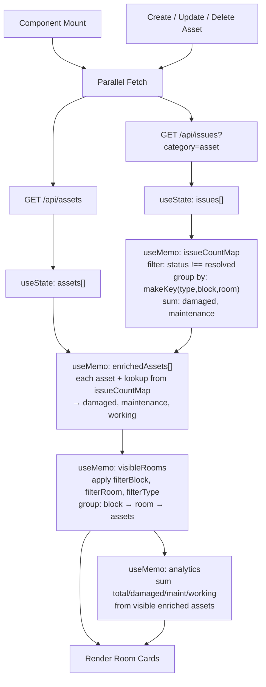

# Room-Centric Facility Assets Refactoring

Refactor the FacilityAssets page from a flat asset list to a **Room-first architecture**: Block → Room Cards → Asset rows with dynamically computed damaged/working/maintenance counts from active issues.

---

## 1. Block Naming — Single Source of Truth

All internal logic, keys, and API calls use the **API block values**: `"Algorithm"` and `"Department"`.

Display labels are applied **only at render time** via a simple map:

```javascript
const BLOCK_DISPLAY_LABELS = {
  'Algorithm': 'Algorithm Block',
  'Department': 'Main Block',
};
const API_BLOCKS = ['Algorithm', 'Department'];

const displayBlock = (apiBlock) => BLOCK_DISPLAY_LABELS[apiBlock] || apiBlock;
```

> [!IMPORTANT]
> The current `roomsConfig.js` uses `'Algorithm Block'` / `'Main Block'` as keys. The FacilityAssets component will **not** use `getBlocksList()` for its block filter. Instead it uses the `API_BLOCKS` constant directly and calls `displayBlock()` for labels only. The `roomsConfig.js` is still used for the **Add/Edit form** room dropdown — we add a `getRoomsForApiBlock()` helper that maps API block → display block → room list.

### Changes to [roomsConfig.js](file:///c:/Users/dharm/finalyrproject/frontend/src/config/roomsConfig.js)

Add mapping helpers:

```javascript
// API block name → display block name → room list
export const getRoomsForApiBlock = (apiBlock) => {
  const displayMap = { 'Algorithm': 'Algorithm Block', 'Department': 'Main Block' };
  const displayBlock = displayMap[apiBlock];
  return ROOM_CONFIG[displayBlock] || [];
};
```

No other files reference these block names for asset logic, so the change is isolated.

---

## 2. Key Normalization

Every key used for lookups is normalized with `trim().toUpperCase()`:

```javascript
const normalize = (val) => (val || '').toString().trim().toUpperCase();

const makeKey = (assetType, block, room) =>
  `${normalize(assetType)}|${normalize(block)}|${normalize(room)}`;
```

This is used consistently in:
- Building the issue count map (from issue fields)
- Looking up counts for each asset (from asset fields)
- No raw string comparisons anywhere

---

## 3. Working Calculation

```javascript
const damaged = counts.damaged;          // from active issues
const maintenance = counts.maintenance;  // from active issues
const working = Math.max(0, total - damaged - maintenance);
```

`Math.max(0, ...)` prevents negative working counts if issue data is inconsistent. Applied at both per-asset and per-room/analytics aggregation levels.

---

## 4. Issue Filtering — Status Handling

Active issues = `status !== 'resolved'` with **case-insensitive** comparison:

```javascript
const isActiveIssue = (issue) =>
  issue.status.toLowerCase() !== 'resolved';

const buildIssueCountMap = (issues) => {
  const map = new Map();
  issues.filter(isActiveIssue).forEach(issue => {
    const key = makeKey(issue.assetType, issue.block, issue.room);
    const entry = map.get(key) || { damaged: 0, maintenance: 0 };
    if (issue.issueType === 'damaged') entry.damaged += (issue.quantity || 0);
    if (issue.issueType === 'maintenance') entry.maintenance += (issue.quantity || 0);
    map.set(key, entry);
  });
  return map;
};
```

> [!NOTE]
> **Current limitation**: We fetch all issues with `category=asset` via `GET /api/issues?category=asset` and filter resolved status on the client. The `GET /api/issues` endpoint only supports exact `?status=X` matching, not `status!= resolved`. For now this is acceptable — asset issues are a small dataset. **Future improvement**: Add a backend query param like `?statusNot=resolved` or a dedicated `/api/assets/health` endpoint that returns pre-aggregated counts per room.

---

## 5. Empty Room Behavior

| Filter State | Room Display Rule |
|---|---|
| **No filters active** | Show only rooms that have ≥1 asset record |
| **Block filter only** | Show all predefined rooms in that block (from `roomsConfig`), even if empty |
| **Room filter selected** | Always show that room, even if no assets |
| **Asset type filter** | Show rooms that have matching asset type; rooms with assets but none matching are hidden |

Implementation:

```javascript
const visibleRooms = useMemo(() => {
  if (filterRoom) {
    // Always show selected room
    const roomAssets = enrichedAssets.filter(a => 
      normalize(a.room) === normalize(filterRoom) &&
      (!filterBlock || normalize(a.block) === normalize(filterBlock)) &&
      (!filterType || a.type === filterType)
    );
    const block = filterBlock || (roomAssets[0]?.block) || '';
    return { [block]: { [filterRoom]: roomAssets } };
  }

  if (filterBlock) {
    // Show all predefined rooms for this block
    const apiBlock = filterBlock;
    const allRoomsInBlock = getRoomsForApiBlock(apiBlock);
    const result = { [apiBlock]: {} };
    allRoomsInBlock.forEach(room => {
      const roomAssets = enrichedAssets.filter(a =>
        normalize(a.block) === normalize(apiBlock) &&
        normalize(a.room) === normalize(room) &&
        (!filterType || a.type === filterType)
      );
      result[apiBlock][room] = roomAssets;
    });
    return result;
  }

  // No filters: only rooms with assets
  const grouped = {};
  enrichedAssets
    .filter(a => !filterType || a.type === filterType)
    .forEach(a => {
      if (!grouped[a.block]) grouped[a.block] = {};
      if (!grouped[a.block][a.room]) grouped[a.block][a.room] = [];
      grouped[a.block][a.room].push(a);
    });
  return grouped;
}, [enrichedAssets, filterBlock, filterRoom, filterType]);
```

---

## 6. Update Flow — No Stale Data

Every mutation triggers a full refresh of both assets and issues:

```javascript
const refreshData = async () => {
  setLoading(true);
  try {
    const [assetRes, issueRes] = await Promise.all([
      assetAPI.getAllAssets(filterBlock ? { block: filterBlock } : {}),
      issueAPI.getAllIssues({ category: 'asset' }),
    ]);
    setAssets(assetRes.data.data);
    setIssues(issueRes.data.data);
  } catch (err) {
    setError(err.response?.data?.message || 'Failed to fetch data');
  } finally {
    setLoading(false);
  }
};

// Called after:
// - Component mount
// - filterBlock change
// - handleSubmit (create/update)
// - handleDelete
// - Form cancel (no refresh needed, just close form)
```

The enrichment pipeline runs in `useMemo` downstream of `assets` and `issues` state — so any state change automatically recomputes all derived data (issueCountMap → enrichedAssets → visibleRooms → analytics). Zero stale data.

---

## 7. Data Flow Diagram



---

## 8. React Component Structure

```
FacilityAssets ({ onBack, isReadOnly })
│
├── State
│   ├── assets[]              ← from GET /api/assets
│   ├── issues[]              ← from GET /api/issues?category=asset
│   ├── filterBlock           ← API block name string
│   ├── filterRoom            ← room string
│   ├── filterType            ← asset type string
│   ├── showForm / editingId / formData
│   └── loading / error / success
│
├── Derived (useMemo chain)
│   ├── issueCountMap         ← Map<normalizedKey, {damaged, maintenance}>
│   ├── enrichedAssets[]      ← assets + computed counts
│   ├── visibleRooms          ← { block: { room: enrichedAsset[] } }
│   ├── flatVisibleAssets[]   ← flat array for analytics
│   └── analytics             ← { total, damaged, maintenance, working }
│
├── Render
│   ├── Header + "Add Asset" button
│   ├── FilterBar
│   │   ├── Block dropdown (API_BLOCKS with displayBlock labels)
│   │   ├── Room dropdown (from roomsConfig, filtered by block)
│   │   └── Asset Type dropdown (from ASSET_TYPES)
│   ├── AnalyticsPanel (4 stat cards + status bar)
│   ├── AddEditAssetForm (shown when showForm=true)
│   └── BlockSection (for each block in visibleRooms)
│       ├── Block header with badge
│       └── RoomCard (for each room)
│           ├── Room header (name, block badge, summary counts)
│           ├── Status bar (working/damaged/maintenance proportions)
│           ├── AssetRow (for each asset)
│           │   ├── Type | Total | Working | Damaged | Maint.
│           │   └── Edit | Delete buttons
│           └── Empty state (if room visible but no matching assets)
```

---

## 9. Proposed File Changes

### [MODIFY] [roomsConfig.js](file:///c:/Users/dharm/finalyrproject/frontend/src/config/roomsConfig.js)

- Add `getRoomsForApiBlock(apiBlock)` helper
- Existing functions remain unchanged (used by other components like ReportIssue)

---

### [MODIFY] [api.js](file:///c:/Users/dharm/finalyrproject/frontend/src/services/api.js)

- No new methods needed. We already have `issueAPI.getAllIssues(params)` which supports `{ category: 'asset' }`.

---

### [MODIFY] [FacilityAssets.js](file:///c:/Users/dharm/finalyrproject/frontend/src/pages/admin/FacilityAssets.js)

**Full rewrite** of the component. Key changes:

1. **Imports**: Add `issueAPI` import, add `getRoomsForApiBlock` import
2. **State**: Add `issues` state, define `API_BLOCKS` + `displayBlock()` locally
3. **Fetch**: Parallel fetch of assets + issues on mount and after mutations
4. **Derived data**: `useMemo` chain: issueCountMap → enrichedAssets → visibleRooms → analytics
5. **Filters**: Use API block names internally, display labels in dropdowns
6. **Room dropdown**: Populated from `getRoomsForApiBlock(filterBlock)` when block selected
7. **Render**: Block → RoomCard → AssetRow structure
8. **Form**: Block dropdown uses `API_BLOCKS` with display labels; room dropdown uses `getRoomsForApiBlock(formData.block)`
9. **Analytics**: Computed from flat visible assets, reflects current filter state

---

### Backend — No Changes

All existing endpoints reused as-is:

| Endpoint | Purpose |
|---|---|
| `GET /api/assets?block=Department` | Fetch assets (optional block filter) |
| `GET /api/issues?category=asset` | Fetch all asset issues (client filters resolved) |
| `POST /api/assets` | Create asset |
| `PUT /api/assets/:id` | Update asset |
| `DELETE /api/assets/:id` | Delete asset |

---

## 10. Edge Cases Handled

| Edge Case | Handling |
|---|---|
| Asset with 0 total | Shown with 0/0/0 counts (unlikely per schema min:1) |
| Damaged > total (data inconsistency) | `working = Math.max(0, total - damaged - maintenance)` prevents negative |
| Issue with null quantity | `(issue.quantity \|\| 0)` in aggregation |
| Issue status "Resolved" vs "resolved" | `status.toLowerCase() !== 'resolved'` |
| Room in config but no assets | Shown only when block filter active, with empty state message |
| Asset type filter hides all assets in a room | Room hidden (no empty room card shown for type filter) |
| Block filter + Room filter mismatch | Room dropdown only shows rooms for selected block |
| Concurrent create + stale view | Full refresh after every CRUD operation |
| Asset type with special chars/spaces (e.g. "LED Board") | Normalized via `trim().toUpperCase()` in key |
| Block name "Department" displayed as "Main Block" | `displayBlock()` mapping at render time only |

---

## 11. Consistency with Issue System

- Issue creation (`createIssueWithSync`) validates against Asset records — **unchanged**
- Issue resolution removes from active count automatically (status becomes 'resolved') — **unchanged**
- The frontend's `buildIssueCountMap` mirrors the backend's `aggregateAssetCounts` logic exactly (same grouping key, same filter, same sum)
- No new database fields, no stored derived values, no hardcoded counts

---

## 12. Verification Plan

### Build & Compile
```bash
cd frontend && npm run build
```

### Browser Testing
1. Navigate to Admin Dashboard → Facility Assets
2. Verify room cards render grouped by block
3. Test each filter independently and in combination
4. Verify analytics numbers match card totals
5. Create a new asset → verify room card appears/updates
6. Edit asset total → verify working count recalculates
7. Delete asset → verify room card updates or disappears
8. Cross-check damaged counts against ManageIssues page for same block/room

### Future Improvements (Not in Scope)
- Backend `GET /api/assets/room-summary` endpoint for server-side aggregation
- Backend `?statusNot=resolved` filter support on issues endpoint
- WebSocket or polling for real-time updates when issues change
